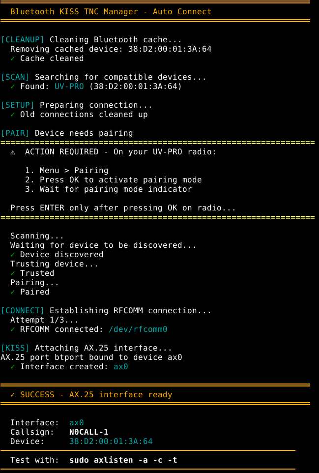
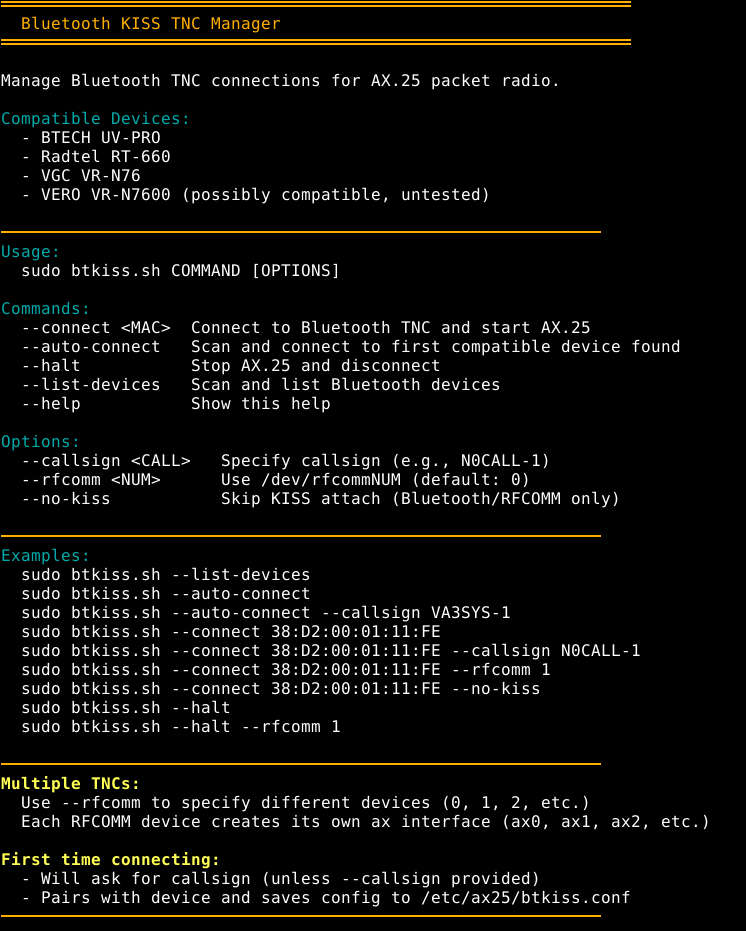

# btkiss.sh - Bluetooth KISS TNC Manager

A simple, user-friendly script to manage Bluetooth TNC connections for AX.25 packet radio on Linux.

## Features

- 🔍 **Auto-discovery** - Automatically finds and connects to compatible TNCs
- 📡 **Multi-TNC support** - Run multiple TNCs simultaneously with different RFCOMM devices
- 🎨 **Clean interface** - Color-coded output with clear progress indicators
- ⚙️ **Zero configuration** - Works out of the box with sensible defaults
- 🔧 **Flexible options** - CLI parameters for non-interactive operation
- ✅ **Robust pairing** - Proper Bluetooth pairing sequence with retry logic

## Compatible Devices

- **BTECH UV-PRO**
- **Radtel RT-660**
- **VGC VR-N76**
- **VERO VR-N7600** (possibly compatible, untested)

## Requirements

```bash
sudo apt update
sudo apt install -y ax25-tools ax25-apps bluetooth
```

## Installation

```bash
# Download the script
curl -LO https://raw.githubusercontent.com/8ff/btkiss/main/btkiss.sh

# Make it executable
chmod +x btkiss.sh
```

## Quick Start

### First Time Setup

1. **Enable pairing and TNC on your radio:**
   - Menu → Pairing → Press OK
   - Menu → General Settings → KISS TNC → Enable

2. **Auto-connect:**
   ```bash
   sudo ./btkiss.sh --auto-connect
   ```

3. **Enter your callsign when prompted** (e.g., `N0CALL-1`)

That's it! Your AX.25 interface is ready.



## Usage

### Commands

```bash
# Scan for devices
sudo ./btkiss.sh --list-devices

# Auto-connect to first compatible device
sudo ./btkiss.sh --auto-connect

# Connect to specific device
sudo ./btkiss.sh --connect <MAC_ADDRESS>

# Stop and disconnect
sudo ./btkiss.sh --halt

# Show help
sudo ./btkiss.sh --help
```



### Options

```bash
--callsign <CALL>   # Specify callsign (e.g., N0CALL-1)
--rfcomm <NUM>      # Use /dev/rfcommNUM (default: 0)
--no-kiss           # Skip KISS attach (Bluetooth/RFCOMM only)
```

### Examples

```bash
# Auto-connect with callsign
sudo ./btkiss.sh --auto-connect --callsign N0CALL-1

# Connect to specific MAC address
sudo ./btkiss.sh --connect 38:D2:00:01:11:FE

# Use second RFCOMM device (for multiple TNCs)
sudo ./btkiss.sh --connect 38:D2:00:01:11:FE --rfcomm 1

# Bluetooth only (no KISS attach)
sudo ./btkiss.sh --connect 38:D2:00:01:11:FE --no-kiss

# Stop second TNC
sudo ./btkiss.sh --halt --rfcomm 1
```

## Multiple TNCs

You can run multiple TNCs simultaneously by using different RFCOMM devices:

```bash
# First TNC on rfcomm0 → creates ax0
sudo ./btkiss.sh --connect 38:D2:00:01:11:FE --rfcomm 0 --callsign N0CALL-1

# Second TNC on rfcomm1 → creates ax1
sudo ./btkiss.sh --connect 38:D2:00:01:22:FF --rfcomm 1 --callsign N0CALL-2
```

Each RFCOMM device creates its own AX.25 interface (ax0, ax1, ax2, etc.)


## Radio Configuration

### Enable KISS TNC on UV-PRO

1. Menu → General Settings → KISS TNC → **Enable**
2. Save and exit

### Enable Pairing Mode

1. Menu → Pairing → Press **OK**
2. Wait for pairing indicator
3. Device is discoverable for ~2 minutes

## Testing Your Connection

```bash
# Monitor packets
sudo axlisten -a -c -t

# Test transmission (from another station)
echo "Hello World" | beacon -s btport -d DEST-0
```

## Troubleshooting

### Device not found during scan

- Ensure radio is powered ON
- Enable pairing mode: Menu → Pairing → Press OK
- Radio must be in pairing mode during initial scan
- Try again: `sudo ./btkiss.sh --list-devices`

### Authentication Failed

This means you didn't press OK in pairing mode on the radio:

1. Turn radio OFF then ON
2. Menu → Pairing → Press OK
3. Run script again

### Connection Refused

Radio needs to be restarted:

1. Turn radio OFF then ON
2. Menu → Pairing → Press OK
3. Run script again

### KISS TNC not enabled

Make sure KISS is enabled on your radio:
- Menu → General Settings → KISS TNC → Enable

### Interface ax0 not created

Check the output of:
```bash
ip link show ax0
cat /proc/net/ax25
```

If interface doesn't exist, try:
```bash
sudo ./btkiss.sh --halt
sudo ./btkiss.sh --auto-connect
```

## How It Works

1. **Cleanup** - Removes cached Bluetooth device data
2. **Scan** - Discovers compatible TNCs
3. **Pair** - Trust then pair
4. **Connect** - Establishes RFCOMM serial connection
5. **Attach** - Creates AX.25 network interface with KISS

## Files Created

- `/etc/ax25/btkiss.conf` - Saved MAC address and callsign
- `/etc/ax25/axports` - AX.25 port configuration

## Technical Details

- Uses Bluetooth Classic (BR/EDR) Serial Port Profile (SPP)
- RFCOMM for serial port emulation
- KISS protocol for TNC communication
- Creates AX.25 network interface (ax0, ax1, etc.)

## 73!

Happy packet radio operating! 📻
